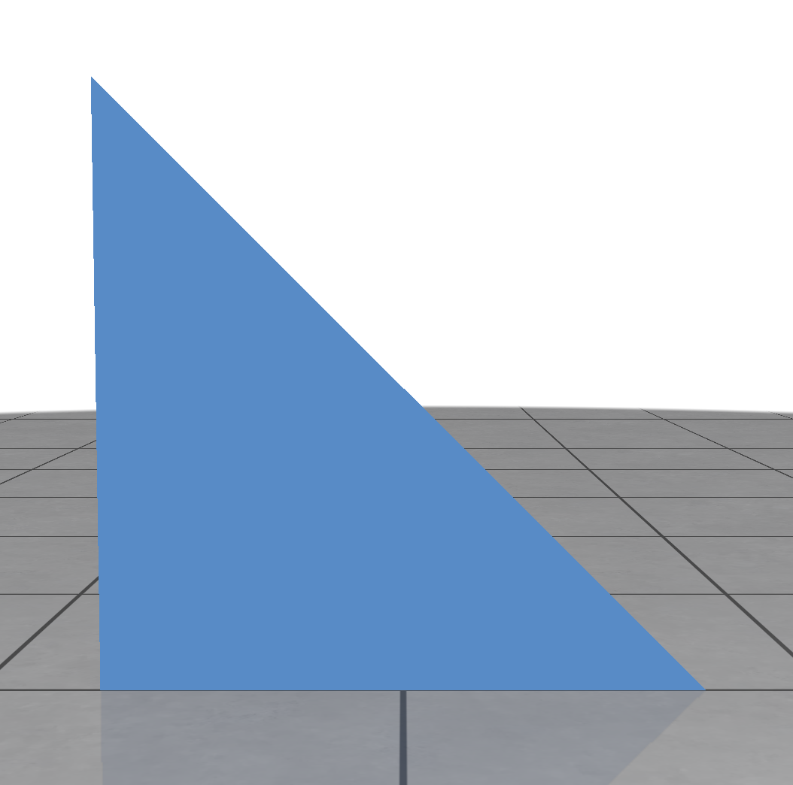
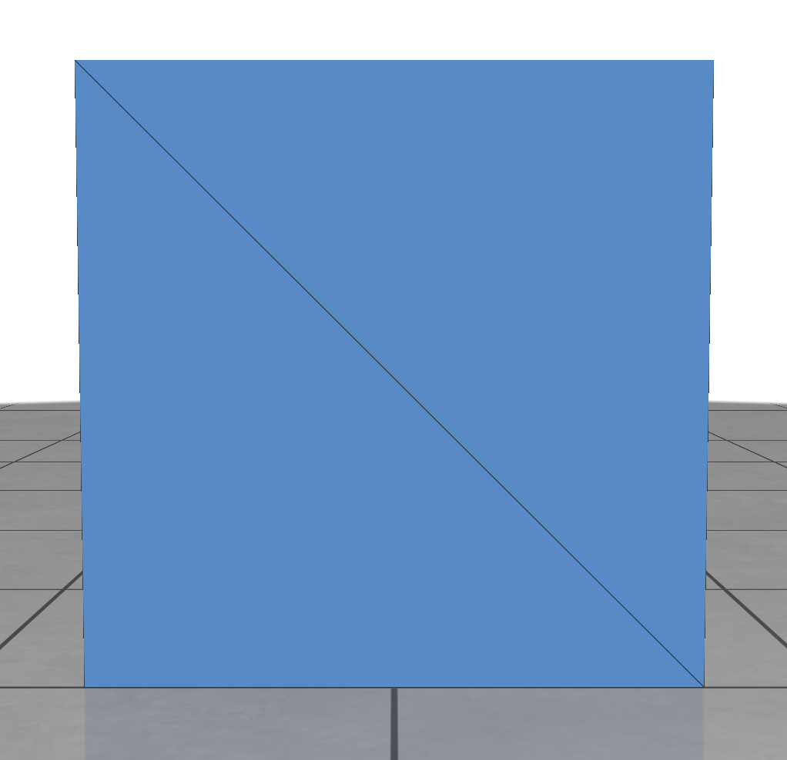
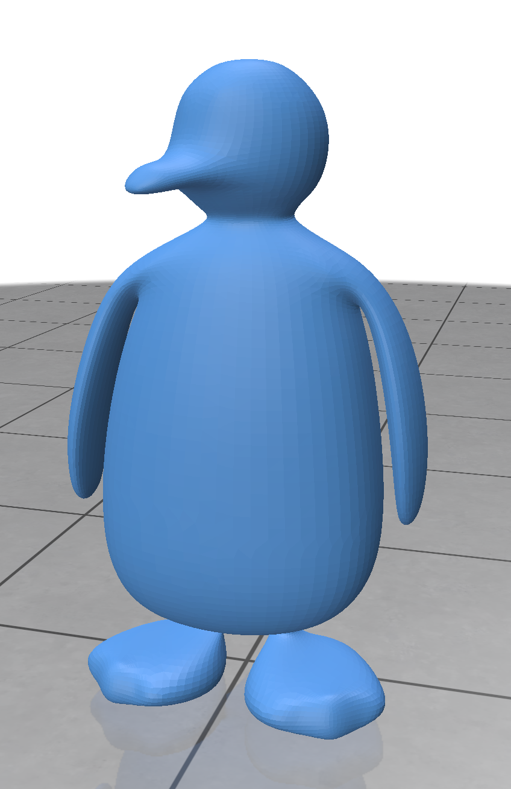
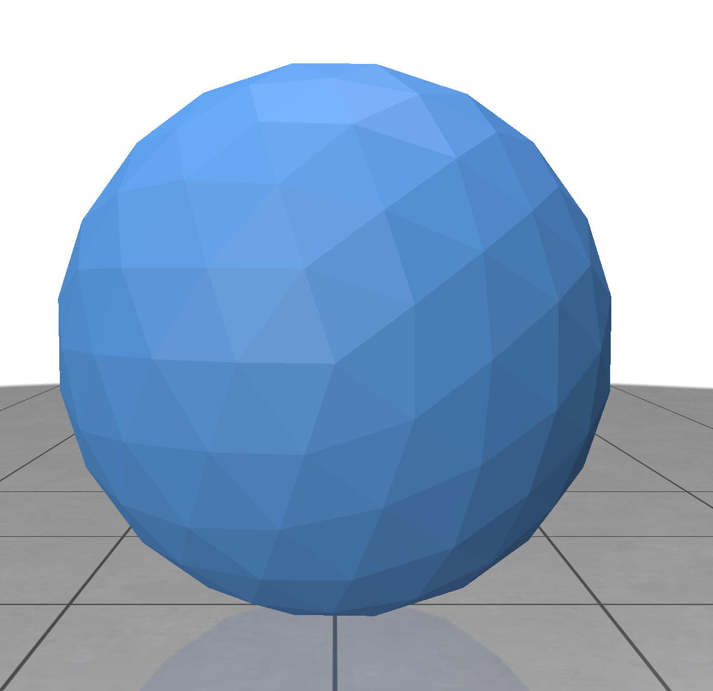
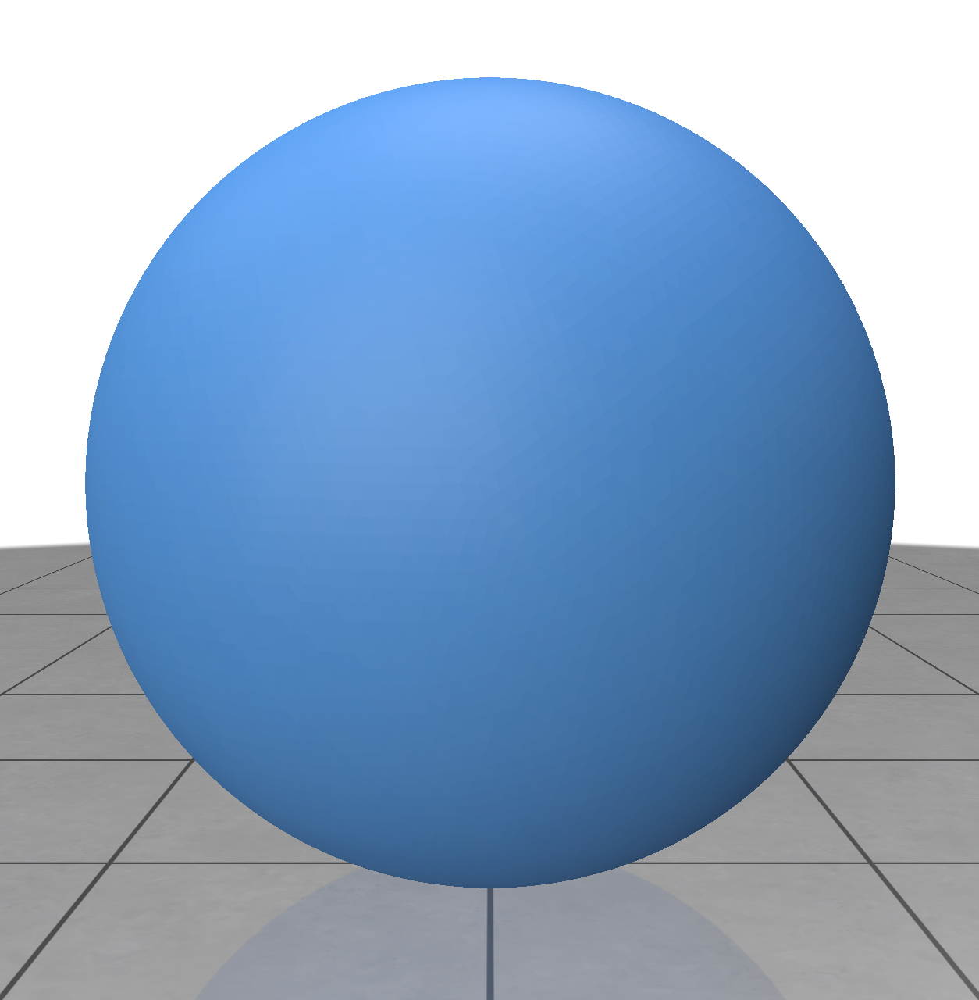

# Exercise 02
_Geometry Processing Research in Python_

## Creating, reading, and writing meshes

The basic discrete surface representation in Gpytoolbox is the triangle mesh
(for two-dimensional surfaces) or the polyline (for one-dimensional lines).
In this exercise we look at how surfaces can be created with Gpytoolbox.

A triangle mesh is a surface consisting of piecewise triangles.
It is fully specified by the coordinates of the vertices (each triangular face
has three) and a list of all triangles.

### vertex-list-face-list

A simple format for specifying triangle meshes is the _vertex-list-face-list_.
Most Gpytoolbox methods input and output this representation:
You can safely assume that a mesh is given in the vertex-list-face-list format,
unless otherwise specified.

The _vertex list_ part of the format is a matrix `V` where every row is a vertex
in the triangle mesh.
There are as many rows as there are vertices in the triangle mesh, and there
are as many columns as the dimension of the surrounding space (usually 2 or 3).
Thus, in Python, `V` is a `(n,d)` NumPy array.

Let us generate a very simple vertex list that consists only of three vertices:
$$v_1 = \begin{pmatrix}0 \\ 0\end{pmatrix}, \quad v_2 = \begin{pmatrix}1 \\ 0\end{pmatrix}, v_3 = \begin{pmatrix}0 \\ 1\end{pmatrix} .$$
```python
import numpy as np
V = np.array([[0.,0.], [1.,0.], [0.,1.]])
print(f"V = {V}")
```
This prints:
```
[[0. 0.]
 [1. 0.]
 [0. 1.]]
```
The first row is $v_1$, the second row is $v_2$, and the third row is $v_3$.

The _face list_ part of the format is a matrix `F` where every row is a triangle
in a triangle mesh.
There are three entries per row of `F`, each corresponding to a different
vertex, and the three vertices of a row make up a triangle.
The entries are indices pointing to rows in `V`.
You can think of each entry like a pointer into `V`.
We follow Python's 0-indexing convention.

So, in order to specify a triangle list with one triangle with vertices
$v_1, v_2, v_3$, we create a face list with one row that has the indices
`0, 1, 2` (these point to the first, second, and third row of `V` respectively):
```python
import numpy as np
F = np.array([[0, 1, 2]])
print(f"F = {F}")
```
This prints:
```
F = [[0 1 2]]
```

Here's a Polyscope visualization of our one-triangle mesh (we will dive into
how Polyscope works in greater detail in [exercise 03](../exercise_03)):
```python
import numpy as np, polyscope as ps
V = np.array([[0.,0.], [1.,0.], [0.,1.]])
F = np.array([[0, 1, 2]])
ps.init()
ps.register_surface_mesh("mesh", V, F)
ps.show()
```
This displays:



The order in which you specify the vertices in each row of `F` matters for the
orientation of the triangle.
By convention, we orient triangles in 2D in a counter-clockwise fashion, and
triangles in 3D so that, when viewed from the outside the vertices are in
counter-clockwise order.

_NOTE: There are three entries in each row of `F` regardless of the dimension
`d` of the surrounding space, since a triangle always has three vertices.
Only the number of columns in `V` can vary._

In order to add a second triangle to our triangle-list-face-list mesh, we
add a new vertex to `V` and a new row to `F`:
```python
import numpy as np, polyscope as ps
V = np.array([[0.,0.], [1.,0.], [0.,1.], [1.,1.]])
F = np.array([[0, 1, 2], [2,1,3]])
ps.init()
ps.register_surface_mesh("mesh", V, F)
ps.show()
```
This displays:



### Writing and reading mesh files

We do not need to limit ourselves to only meshes generated by writing each
triangle individually into the console.
Triangle meshes can be saved as files and shared that way, for example using
the Wavefront `OBJ` format.
In Gpytoolbox we can read these files using the `read_mesh` function.
Navigate to the folder of this exercise and execute the following code to
read the penguin mesh:
```python
import numpy as np, polyscope as ps, gpytoolbox as gpy
V,F = gpy.read_mesh('data/penguin.obj')
ps.init()
ps.register_surface_mesh("mesh", V, F)
ps.show()
```
This displays:



Congratulations on using your first Gpytoolbox function!

Writing meshes is just as easy.
If we want to write our two-triangle mesh from before into an `OBJ` file,
we can use the `write_mesh` function, which takes as input the output
file path, the vertex list, and the face list:
```python
import numpy as np, gpytoolbox as gpy
V = np.array([[0.,0.,0.], [1.,0.,0.], [0.,1.,0.], [1.,1.,0.]])
F = np.array([[0, 1, 2], [2,1,3]])
gpy.write_mesh("twotriangles.obj", V, F)
```
This writes the file `twotriangles.obj` into your current working directory,
which looks like this:
```
v 0 0 0
v 1 0 0
v 0 1 0
v 1 1 0
f 1 2 3
f 3 2 4
```

_NOTE: The Gpytoolbox `read_mesh` function also supports `STL` and `PLY`
meshes._

_NOTE: Gpytoolbox tries to autodetect your mesh file format using file
extensions, but you can also explicitly supply the format using the `fmt`
option._

### Generating functions

The last way to create surfaces in Gpytoolbox beyond writing your own
vertex-list-face-list and reading them from a file is calling dedicated
Gpytoolbox function for certain kinds of regular meshes.

Certain often-used meshes in geometry can be expressed purely using mathematical
formulas, such as the *sphere*, *torus*, *square* and *cube* meshes.
You can generate them at arbitrary resolutions in Gpytoolbox using the built-in
functions
- `icosphere` to create a sphere mesh;
- `torus` to create a torus mesh;
- `regular_square_mesh` to create a square mesh; and
- `regular_cube_mesh` to create a cube mesh.

Here is how you generate a sphere:
```python
import polyscope as ps, gpytoolbox as gpy
V,F = gpy.icosphere(2)
ps.init()
ps.register_surface_mesh("sphere", V, F)
ps.show()
```
This displays:



By passing a higher number to the `icosphere` function, we get a smoother
sphere:
```python
import polyscope as ps, gpytoolbox as gpy
V,F = gpy.icosphere(5)
ps.init()
ps.register_surface_mesh("sphere", V, F)
ps.show()
```
This displays:



## Gpytoolbox documentation

Like many Python libraries, Gpytoolbox uses docstrings to document the
interface of each library function.
If you are ever unsure what parameters a Gpytoolbox function takes, or what it
outputs, there are a variety of ways to access the documentation.
- You can look at
[Gpytoolbox's website](https://gpytoolbox.org/latest/write_mesh/), and select
the function you are looking for from the list on the left.
- You can open your Python console and look at the docstring for an individual
function you are curious about:
```python
import gpytoolbox as gpy
help(gpy.regular_square_mesh)
```
This prints:
```
Help on function regular_square_mesh in module gpytoolbox.regular_square_mesh:

regular_square_mesh(nx, ny=None)
    Triangle mesh of a square
    
    Generates a regular triangular mesh of a one by one square by dividing each grid square into two triangles.
    
    Parameters
    ----------
    nx : int
        number of vertices on the x-axis
    ny : int, optional (default None)
        number of vertices on the y-axis, default nx
    
    Returns
    -------
    V : numpy double array
        Matrix of triangle mesh vertex coordinates
    F : numpy int array
        Matrix of triangle vertex indices into V
    
    See Also
    --------
    regular_cube_mesh.
    
    Notes
    -----
    The ordering of the vertices is increasing by rows and then columns, so [0,0], [h,0], [2*h,0],...,[h,h],[2*h,h],...,[1-h,1],[1,1]
    
    Examples
    --------
    # Generate a 10x10 triangle mesh
    gs = 10
    V, F = gpytoolbox.regular_square_mesh(gs)
```

_NOTE: Press the Q button on your keyboard to exit the help display._

## That's it!

Our next exercise, [exercise_03](../exercise_03), will teach you the basics of
visualizing meshes with Polyscope.

---

_Oded Stein 2024. [Geometry Processing Research in Python](https://github.com/odedstein/geometry-processing-research-in-python)_

