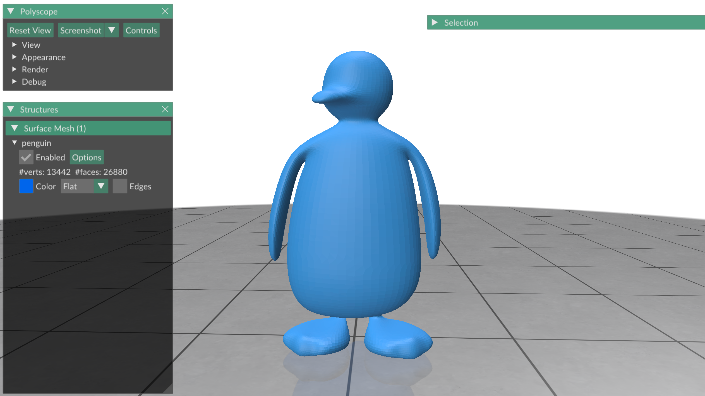
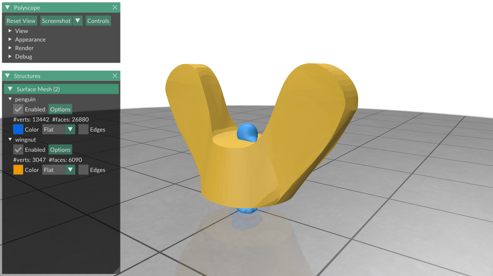
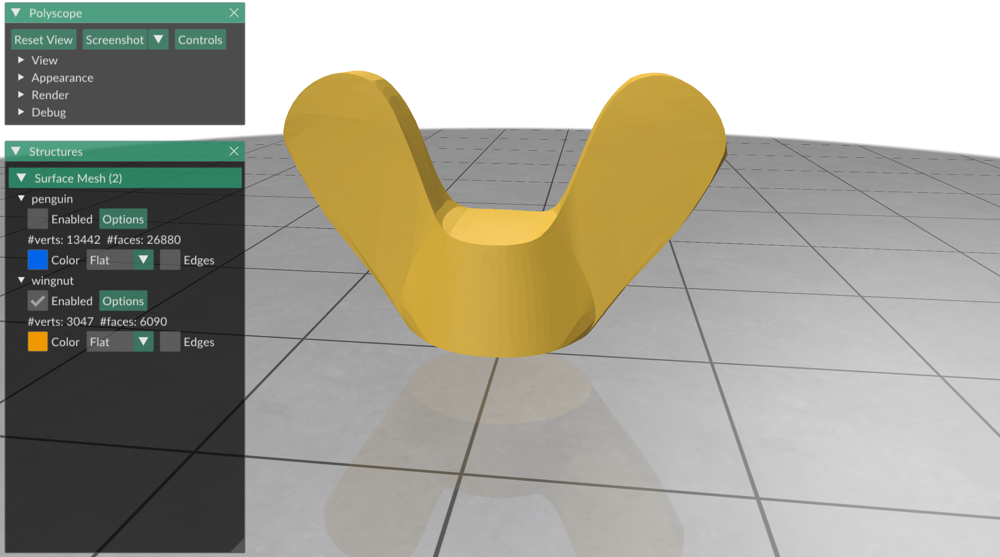
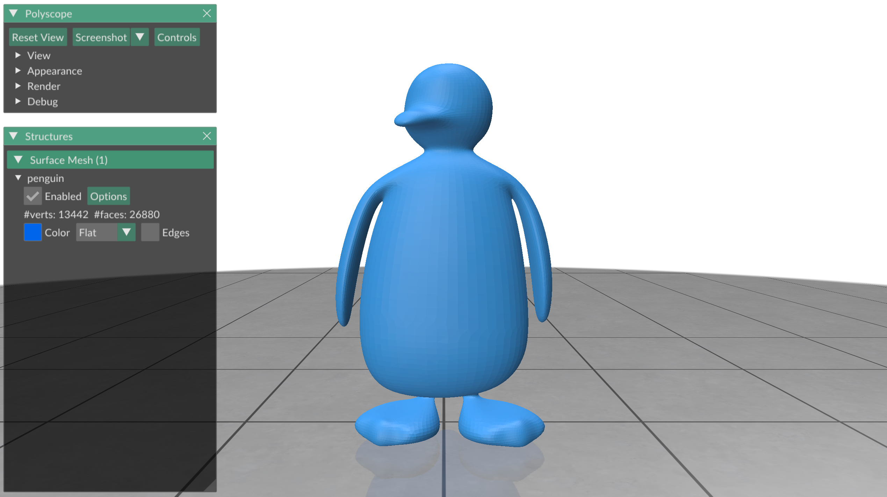
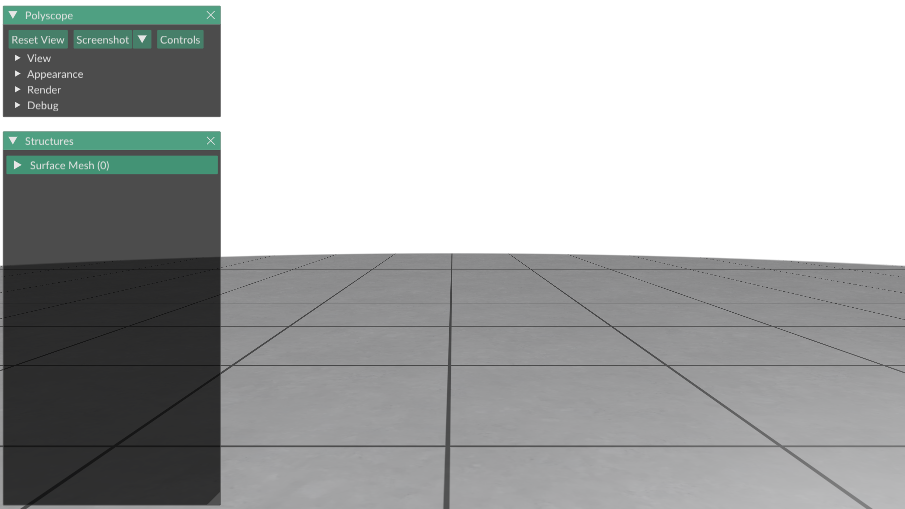
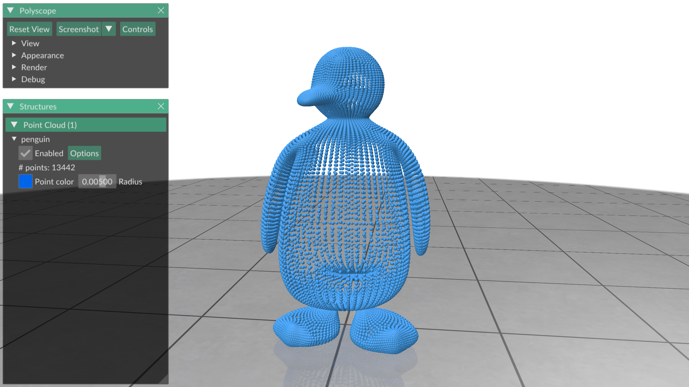
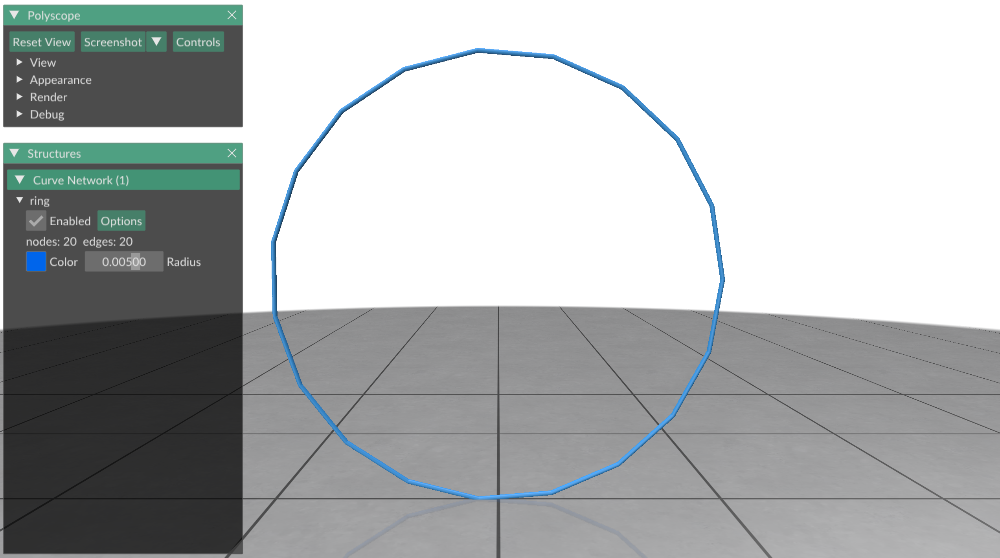
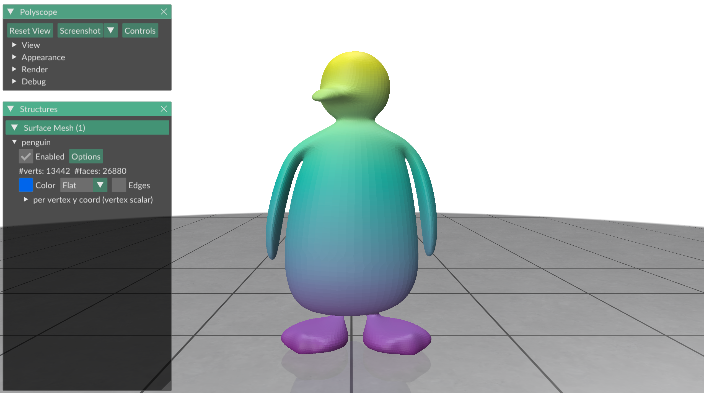
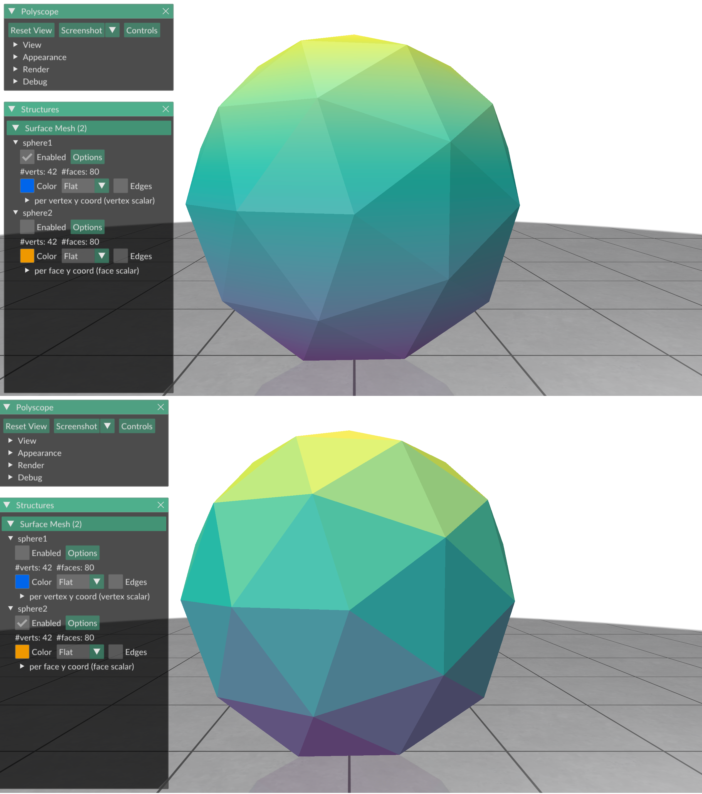

# Exercise 03
_Geometry Processing Research in Python_

## Visualizing geometry

In [exercise 02](../exercise_02) you have already visualized some surfaces with
Polyscope.
In this exercise we will take a closer look on how Polyscope works, and how we
can use it to visualize all kinds of geometry.

### The basic Polyscope loop

Before you can do anything with Polyscope, you need to initialize a Polyscope
session with Polyscope's `init` function.

```python
import polyscope as ps
ps.init()
```

After Polyscope has been initialized, you add _structures_ (shapes) to the
Polyscope scene, and you add _quantities_ to these structures.
A triangle mesh, like we constructed in [exercise 02](../exercise_02), is one
such structure.
Structures in Polyscope have a _unique name_ which is global.
Let us load a triangle mesh and add it as a structure to Polyscope:

```python
import gpytoolbox as gpy, polyscope as ps
V,F = gpy.read_mesh("data/penguin.obj")
ps.init()
ps_penguin = ps.register_surface_mesh("penguin", V, F)
```

Here the name of our surface mesh structure is `"penguin"`, and the structure
is stored in the variable `ps_penguin`.
Instead of assigning the structure to the variable, you can also recover a
reference it to any time using its unique global name:

```python
import gpytoolbox as gpy, polyscope as ps
V,F = gpy.read_mesh("data/penguin.obj")
ps.init()
ps_penguin = ps.register_surface_mesh("penguin", V, F)
ps_penguin_alt = ps.get_surface_mesh("penguin")
#ps_penguin and ps_penguin_alt refer to the same structure.
```

Lastly, after adding our structure, we launch the Polyscope window with
`show()`.

```python
import gpytoolbox as gpy, polyscope as ps
V,F = gpy.read_mesh("data/penguin.obj")
ps.init()
ps_penguin = ps.register_surface_mesh("penguin", V, F)
ps.show()
```
This displays:



_NOTE: If you are familiar with MATLAB or matplotlib, this is slightly
different.
MATLAB and matplotlib do not block the interpreter while the window is launched,
but in Polyscope you cannot issue Python commands while the window is active.
It is possible to return control to Python while the Polyscope window is still
active, but requires advanced functionality._

### Structure management

We can add multiple structures to Polyscope by using `register_surface_mesh`
multiple times.
Be careful to use a different name every time, or you will overwrite an existing
structure!
```python
import gpytoolbox as gpy, polyscope as ps
ps.init()
V,F = gpy.read_mesh("data/penguin.obj")
ps_penguin = ps.register_surface_mesh("penguin", V, F)
V,F = gpy.read_mesh("data/wingnut.obj")
ps_wingnut = ps.register_surface_mesh("wingnut", V, F)
ps.show()
```
This displays:



By default, all surfaces are shown.
You can explicitly decide to show or hide a surface by clicking the
"enabled" checkbox
in the Polyscope GUI, by creating the structure with the option `enabled=True`
(or `enabled=False`),
or by calling `set_enabled(True)` (or `set_enabled(False)`) after creating it.
```python
import gpytoolbox as gpy, polyscope as ps
ps.init()
V,F = gpy.read_mesh("data/penguin.obj")
ps_penguin = ps.register_surface_mesh("penguin", V, F, enabled=False)
V,F = gpy.read_mesh("data/wingnut.obj")
ps_wingnut = ps.register_surface_mesh("wingnut", V, F, enabled=True)
ps_wingnut.set_enabled(True) #the same as enabled=True
ps.show()
```
This displays:



Structures are removed from the Polyscope scene with the `remove()`
function.
```python
import gpytoolbox as gpy, polyscope as ps
ps.init()
V,F = gpy.read_mesh("data/penguin.obj")
ps_penguin = ps.register_surface_mesh("penguin", V, F, enabled=True)
V,F = gpy.read_mesh("data/wingnut.obj")
ps_wingnut = ps.register_surface_mesh("wingnut", V, F)
ps_wingnut.remove()
ps.show()
```
This displays:



To remove all structures, use `remove_all_structures()`:

```python
import gpytoolbox as gpy, polyscope as ps
ps.init()
V,F = gpy.read_mesh("data/penguin.obj")
ps_penguin = ps.register_surface_mesh("penguin", V, F, enabled=True)
V,F = gpy.read_mesh("data/wingnut.obj")
ps_wingnut = ps.register_surface_mesh("wingnut", V, F)
ps.remove_all_structures()
ps.show()
```
This displays:



### Visualizing different kinds of structures

Polyscope can visualize more kinds of geometry than just surfaces.
These structures behave just like surface meshes, but are initialized
differently.
One such example is a _point cloud_.
Unlike a triangle mesh, where we have vertices and faces, a point cloud has
only vertices - every vertex is visualized as a point.
In Polyscope, they are added to the scene with the `register_point_cloud`
function.

```python
import gpytoolbox as gpy, polyscope as ps
V,_ = gpy.read_mesh("data/penguin.obj")
ps.init()
ps_penguin = ps.register_point_cloud("penguin", V)
ps.show()
```
This displays:



Another important structure type is the _polyline_.
A polyline consists of piecewise straight lines (similar to how a triangle mesh
consists of piecewise triangles), and is used to represent arbitrary curves.
You specify it with the usual vertex-list-face-list (see
[exercise 02](../exercise_02)), where each face has two vertices which are the
beginning and end point of each line.

Polyscope calls polylines _curve networks_, and you can add a polyline structure
to the scene with `add_curve_network`.

```python
import gpytoolbox as gpy, polyscope as ps
ps.init()
V,E = gpy.regular_circle_polyline(20)
ps_ring = ps.register_curve_network("ring", V, E)
ps.show()
```
This displays:



### Displaying quantities on structures

Plotting functions on surfaces is an extremely important part of geometry
processing research.
In polyscope you do this by adding a _scalar quantity_ to your structure
with the `add_scalar_quantity` function.
```python
import gpytoolbox as gpy, polyscope as ps
V,F = gpy.read_mesh("data/penguin.obj")
per_vertex_y_coord = V[:,1]
ps.init()
ps_penguin = ps.register_surface_mesh("penguin", V, F)
ps_penguin.add_scalar_quantity("per vertex y coord", per_vertex_y_coord,
    enabled=True)
ps.show()
```

This displays:



In Polyscope you can easily plot both per-vertex functions (one value per
vertex) and per-face (one value per face) functions.
This is done with the `defined_on` option.
```python
import gpytoolbox as gpy, polyscope as ps
V,F = gpy.icosphere(1)
per_vertex_y_coord = V[:,1]
per_face_y_coord = (V[F[:,0],1]+V[F[:,1],1]+V[F[:,2],1])/3.
ps.init()
ps_sphere1 = ps.register_surface_mesh("sphere1", V, F)
ps_sphere1.add_scalar_quantity("per vertex y coord", per_vertex_y_coord,
    defined_on='vertices', enabled=True)
ps_sphere2 = ps.register_surface_mesh("sphere2", V, F)
ps_sphere2.add_scalar_quantity("per face y coord", per_face_y_coord,
    defined_on='faces', enabled=True)
ps.show()
```

This displays:



The [`defined_on` option has many more possible values](https://polyscope.run/py/structures/surface_mesh/scalar_quantities/),
which are beyond the scope of this tutorial.

If you plot multiple functions on the same structure, use the `enabled=True`
option to decide which function is plotted - you can only plot one function at
a time.

_NOTE: Instead of simply plotting scalar functions, you can also decide to plot
a specific color per vertex/face with `add_color_quantity`.
Only do this to actually display a color quantity - if you simply want a
different color map for displaying a scalar quantity,
[exercise_04](../exercise_04) will show you how to do that._

### There is so much more

Polyscope is an extremely powerful visualization tool.
[The Polyscope documentation](https://polyscope.run/py/) is very extensive, and
a good overview of all the other functionality that is included in the library.


## That's it!

Our next exercise, [exercise_04](../exercise_04), will teach you how you can
use shading and perspective to achieve different visualization effects with
Polyscope.

---

_Oded Stein 2024. [Geometry Processing Research in Python](https://github.com/odedstein/geometry-processing-research-in-python)_

