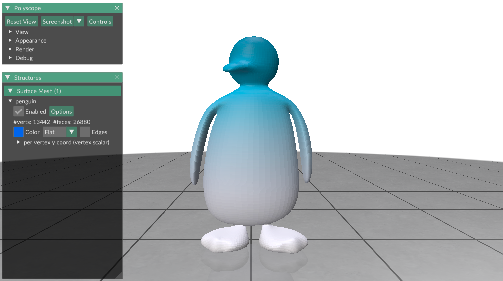
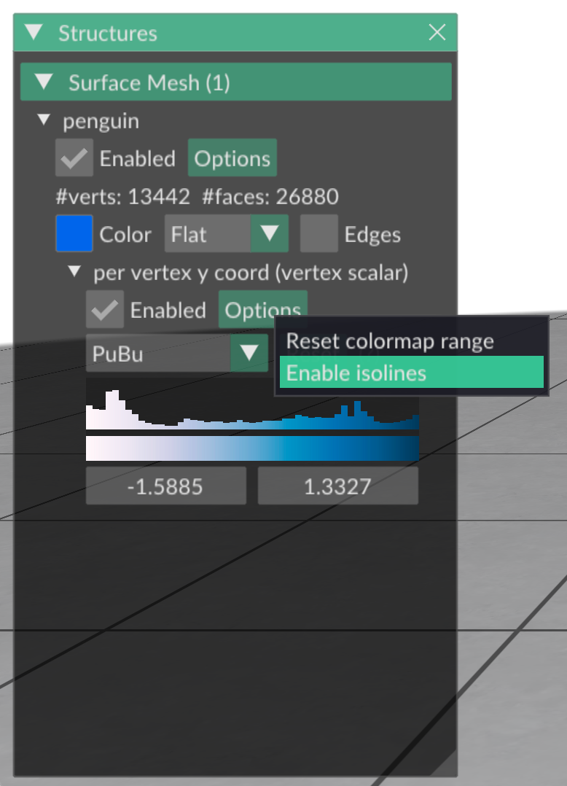
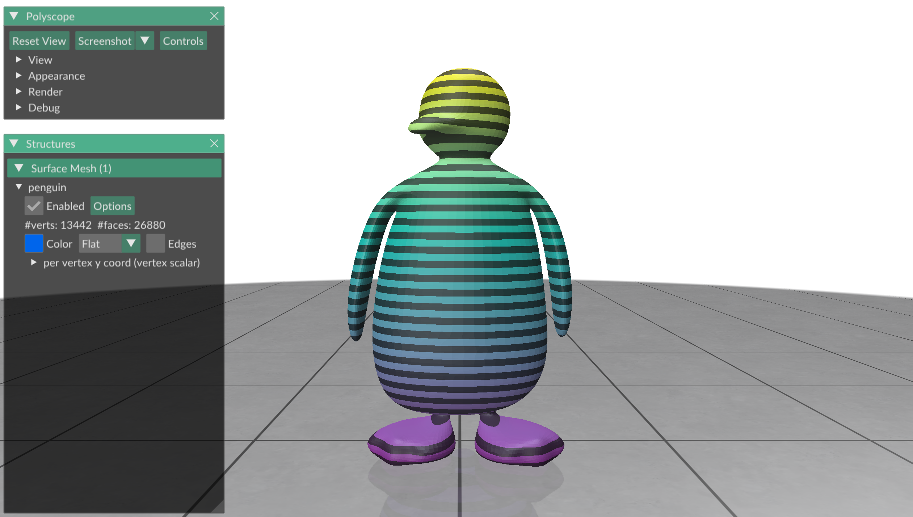
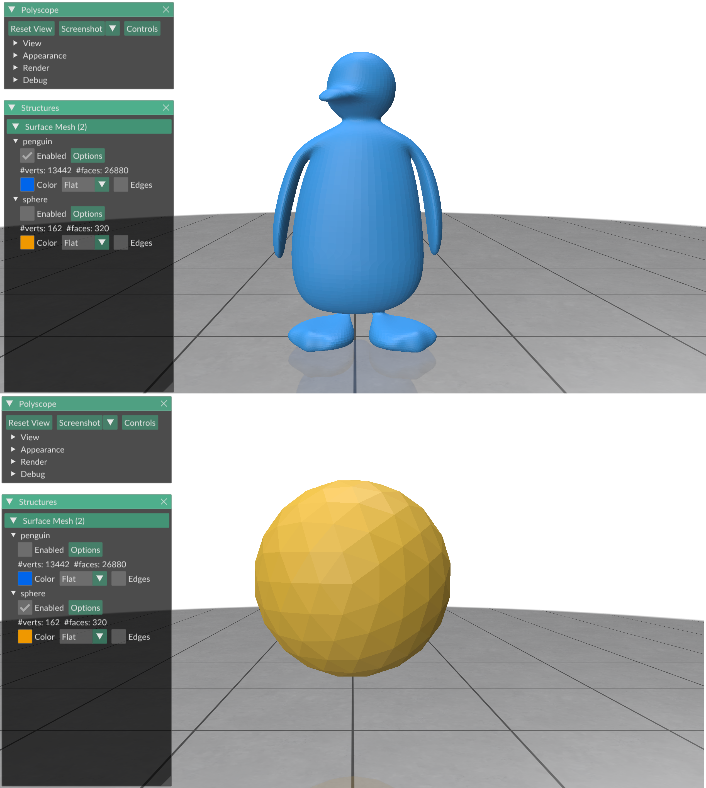
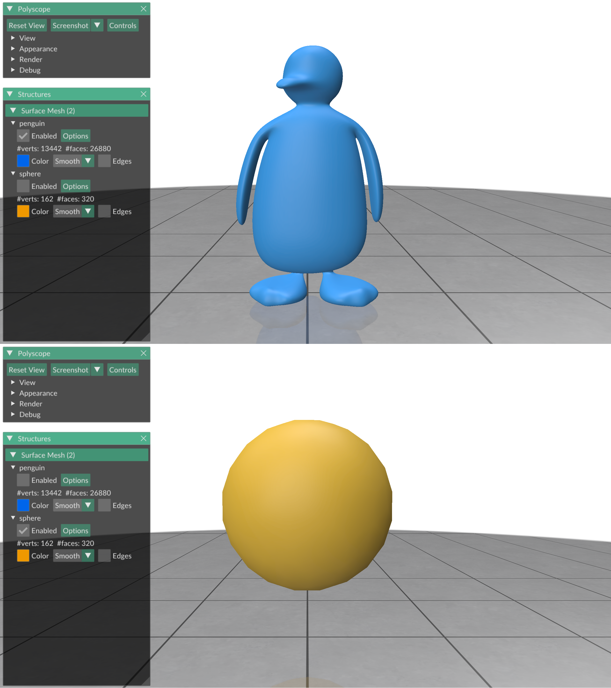
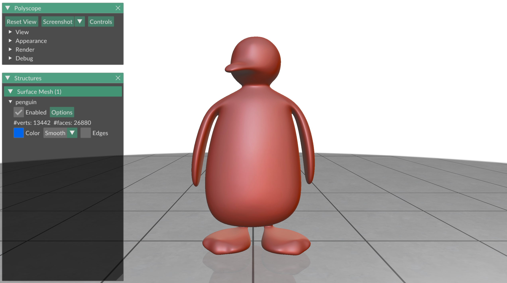
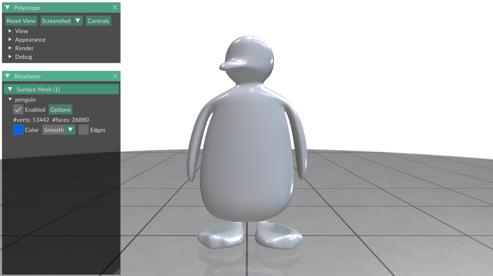

# Exercise 04
_Geometry Processing Research in Python_

## Shading and perspective

In [exercise 03](../exercise_03) you have seen how to visualize shapes in
Polyscope and use its interactive viewer.
In this exercise we will delve a little bit deeper into visualization.
What can we do to enhance our visualizations, and how do we best communicate
our intentions through visualization?

### Plotting scalar functions well <!-- colormaps and vmin, vmax -->

[Exercise 03](../exercise_03) taught you to plot a scalar function on a surface
in Polyscope using the `add_scalar_quantity` function.
There are a few important questions to ask yourself when you use
`add_scalar_quantity`.
We will look at two of them here: What _colormap_ to use, and how to set its
_range_.

When functions are plotted in Polyscope, different function values are assigned
to different color values.
This map from function values to color values is called the _color map_.
By default, Polyscope uses the [viridis](https://matplotlib.org/stable/users/explain/colors/colormaps.html)
color map, but we can change it to another one by using the `cmap` argument of
the `add_scalar_quantity` function.
For example, to use the `reds` color map:
```python
import gpytoolbox as gpy, polyscope as ps
V,F = gpy.read_mesh("data/penguin.obj")
per_vertex_y_coord = V[:,1]
ps.init()
ps_penguin = ps.register_surface_mesh("penguin", V, F)
ps_penguin.add_scalar_quantity("per vertex y coord", per_vertex_y_coord,
    enabled=True, cmap='reds')
ps.show()
```

If your data is _sequential_, i.e., you are displaying function values on a
spectrum from a small value to a large value (like coordinates), you can use
the following built-in sequential Polyscope colormaps:
- `viridis`
- `blues`
- `reds`

If, on the other hand, you are plotting _cyclic_ data (such as the angle),
you can use the color map `phase`.
If you want a color map that is symmetric around zero there are:
- `coolwarm`
- `pink-green`

Personally, I think the best color maps that exist are
[Cynthia Brewer's ColorBrewer color maps](https://colorbrewer2.org).
To use them (or any other) custom color map in Polyscope, you need an image of
the color map going from the left to the right side of the screen.
Here is ColorBrewer's `PuBu` color map:


Then this image can be used as a custom color map using Polyscope's
`load_color_map` function:

```python
import gpytoolbox as gpy, polyscope as ps
V,F = gpy.read_mesh("data/penguin.obj")
per_vertex_y_coord = V[:,1]
ps.init()
ps_penguin = ps.register_surface_mesh("penguin", V, F)
ps.load_color_map("PuBu", "data/PuBu.png")
ps_penguin.add_scalar_quantity("per vertex y coord", per_vertex_y_coord,
    enabled=True, cmap='PuBu')
ps.show()
```

This displays:



It is sometimes helpful to display the _isolines_ of the plotted function as
black lines along which the function is constant.
You can do this by either clicking the appropriate button in the Polyscope GUI,
or by using the `isolines_enabled` option (with `isoline_darkness` and
`isoline_width` used to customize the appearance of the isoline):



```python
import gpytoolbox as gpy, polyscope as ps
V,F = gpy.read_mesh("data/penguin.obj")
per_vertex_y_coord = V[:,1]
ps.init()
ps_penguin = ps.register_surface_mesh("penguin", V, F)
ps_penguin.add_scalar_quantity("per vertex y coord", per_vertex_y_coord,
    isolines_enabled=True, isoline_width=0.05, isoline_darkness=0.1,
    enabled=True)
ps.show()
```
This displays:



By default, Polyscope will start the colormap at the lowest value of the
function that you are plotting, and will end it at the highest value of your
function.
You might want to override this behavior (for example, because you are plotting
multiple functions with the same color scale for comparison's sake)
with the `vminmax` argument to the `add_scalar_quantity` function.
It takes a tuple consisting of to the lower and upper boundaries of the
color map.

### Perspective

Have you ever asked yourself how a 3D object gets turned into a 2D object to
plot on screen?
In a computer graphics class you can learn all types of
[3D projections](https://en.wikipedia.org/wiki/3D_projection).
Polyscope supports two of them: _perspective_ and _orthographic_, and you
can switch between them with the `set_view_projection_mode` function.

You should use orthographic projection if you want parallel lines in 3D to also
be parallel in your 2D view, for example because you want to accurately
represent the angles of a square:
```python
import gpytoolbox as gpy, polyscope as ps
V,F = gpy.regular_square_mesh(2)
ps.init()
ps_square = ps.register_surface_mesh("square", V, F)
ps.set_view_projection_mode("orthographic")
ps.show()
```

This displays:


Our eyes do not perform a perfect orthographic projection in real life, which
is why orthographically projected objects usually look uncanny.
To mimic how our eyes work, use the perspective projection (which is the default
in Polyscope).
The two vertical edges of the square are no longer parallel, but the world
looks more natural:
```python
import gpytoolbox as gpy, polyscope as ps
V,F = gpy.regular_square_mesh(2)
ps.init()
ps_square = ps.register_surface_mesh("square", V, F)
ps.set_view_projection_mode("perspective")
ps.show()
```

This displays:


### Smooth vs. flat shading

Our plots currently all show the triangles of the objects we plot quite
distinctly.
This is especially apparent for coarse meshes:
```python
import gpytoolbox as gpy, polyscope as ps
ps.init()
V,F = gpy.read_mesh("data/penguin.obj")
ps_penguin = ps.register_surface_mesh("penguin", V, F)
V,F = gpy.icosphere(2)
ps_sphere = ps.register_surface_mesh("sphere", V, F)
ps.show()
```

This displays (enabling the two surfaces separately):



This effect stems from the fact that Polyscope uses a variant of the
[Blinn-Phong shading model](https://en.wikipedia.org/wiki/Blinn–Phong_reflection_model)
with _flat shading_:
The normal vector of the shape, used for lighting computations, is constant on
each triangle.
If you want a smoother appearance instead, this can be done by enabling
_smooth shading_; either in the GUI or with the `smooth_shade` argument.
If this argument is used, Polyscope will interpolate normals smoothly across the
shape, resulting in smooth reflections that hide the appearance of individual
triangles:

```python
import gpytoolbox as gpy, polyscope as ps
ps.init()
V,F = gpy.read_mesh("data/penguin.obj")
ps_penguin = ps.register_surface_mesh("penguin", V, F,
    smooth_shade=True)
V,F = gpy.icosphere(2)
ps_sphere = ps.register_surface_mesh("sphere", V, F,
    smooth_shade=True)
ps.show()
```

This displays (enabling the two surfaces separately):



### Materials

The last visualization trick that I very commonly use in Polyscope to make
otherwise boring surfaces look a little bit more interesting is to use
_materials_.
While Polyscope does not support complicated material models found in modern
graphics engine, it supports
[matcaps](https://polyscope.run/py/features/materials/), which can convincingly
approximate a variety of real-world materials.
You can apply them to a surface using the `material` argument.

Here is how you display a mud penguin:
```python
import gpytoolbox as gpy, polyscope as ps
ps.init()
V,F = gpy.read_mesh("data/penguin.obj")
ps_penguin = ps.register_surface_mesh("penguin", V, F,
    material='mud', smooth_shade=True)
ps.show()
```

This displays:



And here is a ceramic penguin:
```python
import gpytoolbox as gpy, polyscope as ps
ps.init()
V,F = gpy.read_mesh("data/penguin.obj")
ps_penguin = ps.register_surface_mesh("penguin", V, F,
    material='ceramic', smooth_shade=True)
ps.show()
```

This displays:



The built-in materials are (where the colorable ones allow you to set a color
on top of the material, or apply a colormap to a plotted function):
- `clay` (colorable)
- `wax` (colorable)
- `candy` (colorable)
- `flat` (colorable)
- `mud` (not colorable)
- `ceramic` (not colorable)
- `jade` (not colorable)
- `normal` (not colorable)

A matcap is a simple image that tells Polyscope what color to render depending
on which angle the surface forms between the camera and the light source.
You can easily create your own matcap images with the `load_static_material`
function - the [Polyscope documentation](https://polyscope.run/py/features/materials/#load_blendable_material)
contains instructions on how to do that.

## That's it!

Our next exercise, [exercise_05](../exercise_05), will be about how to compute
basic geometric quantities of surfaces.

---

_Oded Stein 2024. [Geometry Processing Research in Python](https://github.com/odedstein/geometry-processing-research-in-python)_

