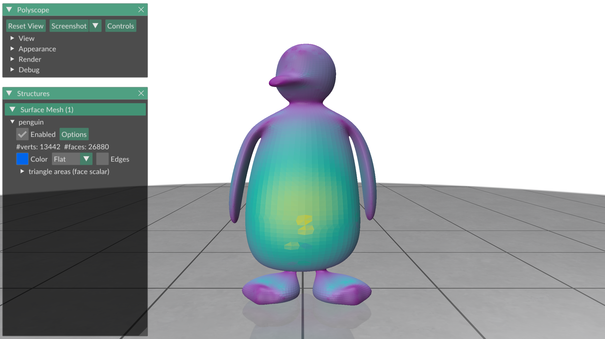
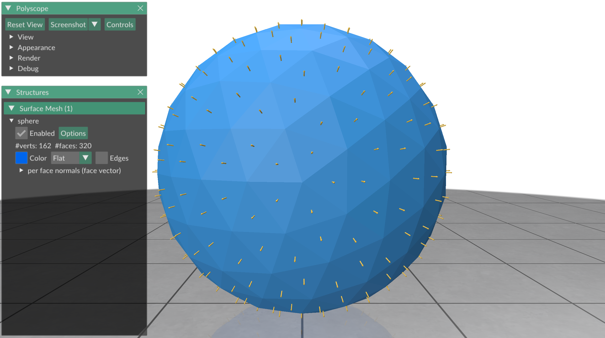
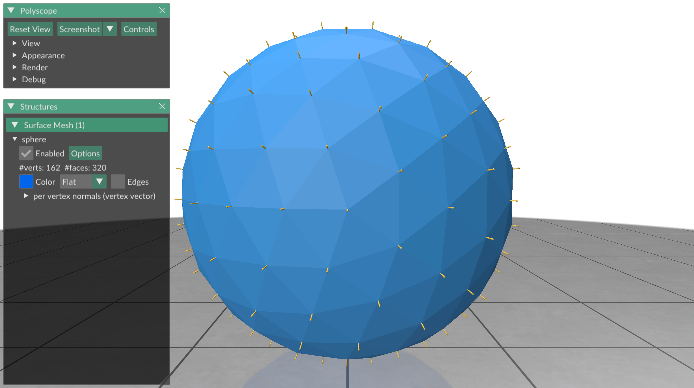
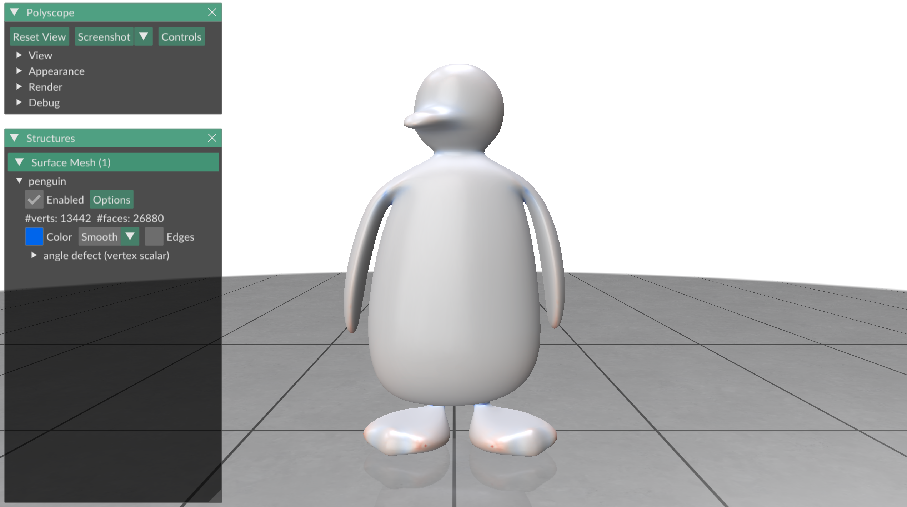

# Exercise 05
_Geometry Processing Research in Python_

## Basic properties of surfaces

You have learned how to create meshes, and all the different ways to display
meshes and data.
In this exercise, we will compute a few basic geometric properties of surfaces.

### Boundary vertices

Every triangle in a triangle mesh is adjacent to another triangle, except for
boundary triangles.
The edges that have only one adjacent triangles form the _boundary loop_, and
the vertices on this boundary loop are the _boundary vertices_.

You can get a list of boundary vertices from Gpytoolbox using
`boundary_vertices`.
For a triangle mesh `V,F`,
the vector `bv = gpy.boundary_vertices(F)` is a list of boundary vertices - each
entry in `bv` refers to a row in `V`:
```python
import gpytoolbox as gpy, polyscope as ps
V,F = gpy.read_mesh("data/penguin_with_bdry.obj")
bv = gpy.boundary_vertices(F)
print(bv)
ps.init()
ps_penguin = ps.register_surface_mesh("penguin", V, F)
ps_penguin_bdry = ps.register_point_cloud("penguin bdry", V[bv,:])
ps.show()
```

This should print the boundary vertex array:
```
[  768  1349  2294  3187  7030  7031  7036  7101  7102  7103  7104  7105
  7106  9604  9605  9606  9607  9612 11550 11552 13124 13126 13130 13133]
```

and display:


For some applications you might actually want the ordered _boundary loops_,
ordered lists of boundary vertices, one for each component.
`bl = gpy.boundary_loops(F)` returns a Python list of boundary components, and
each entry of `bl` is a NumPy array that is an ordered list of all vertices in
this boundary component.
So, to plot the two boundary components separately, we can do the following:
```python
import gpytoolbox as gpy, polyscope as ps
V,F = gpy.read_mesh("data/penguin_with_bdry.obj")
bl = gpy.boundary_loops(F)
print(f"The boundary has {len(bl)} components.")
ps.init()
ps_penguin = ps.register_surface_mesh("penguin", V, F)
ps_penguin_bdry0 = ps.register_point_cloud("penguin bdry 0", V[bl[0],:])
ps_penguin_bdry1 = ps.register_point_cloud("penguin bdry 1", V[bl[1],:])
ps.show()
```

This should print
```
The boundary has 2 components.
```

and display:


_NOTE: Gpytoolbox can also extract the boundary edges with `boundary_edges`._

### Triangle areas

Another basic triangle mesh quantity that we use a lot is the triangle area.
Triangle areas can be computed in Gpytoolbox with the `doublearea` function.
It returns a list of floating point values, where the `n`-th entry is the
double area of the `n`-th triangle (the `n`-th row in the face list `F`).
In code,
```python
import gpytoolbox as gpy, numpy as np, polyscope as ps
V,F = gpy.read_mesh("data/penguin.obj")
A = 0.5 * gpy.doublearea(V,F)
print(f"Total mesh area: {np.sum(A)}")
ps.init()
ps_penguin = ps.register_surface_mesh("penguin", V, F)
ps_penguin.add_scalar_quantity("triangle areas", A,
    defined_on='faces', enabled=True)
ps.show()
```

This should print
```
Total mesh area: 12.730073170563058
```

and display:



### Normals

We have already talked about the normals of a triangle mesh when we talked
about shading.
But how do you compute the normals if you just want the vectors?

You can compute the unit normal of each triangle in a mesh `V,F` with the
function `per_vertex_normals`.
It returns a matrix of the same dimension as `F`:
There is one row for each triangle in `F`, and each row are the coordinates of
a vector in 3D - the normal vector.
We plot it with Polyscope's `add_vector_quantity` function, which works just
like `add_scalar_quantity`, except for a list of scalars per element it
wants a list of vectors per element as its second argument.
```python
import gpytoolbox as gpy, numpy as np, polyscope as ps
V,F = gpy.icosphere(2)
N = gpy.per_face_normals(V,F)
ps.init()
ps_sphere = ps.register_surface_mesh("sphere", V, F)
ps_sphere.add_vector_quantity("per face normals", N,
    defined_on='faces', enabled=True)
ps.show()
```

This displays:



Sometimes we need normal vectors on vertices.
A triangle mesh does not have actual normal vectors (i.e., vectors that are
perpendicular to the surface) at a vector, but we can get an approximation of
a smooth surface's normal vector using Gpytoolbox's `per_vertex_normals`
function:
```python
import gpytoolbox as gpy, numpy as np, polyscope as ps
V,F = gpy.icosphere(2)
Nv = gpy.per_vertex_normals(V,F)
ps.init()
ps_sphere = ps.register_surface_mesh("sphere", V, F)
ps_sphere.add_vector_quantity("per vertex normals", Nv,
    defined_on='vertices', enabled=True)
ps.show()
```

This displays:



### Angle defect

The last geometric quantity which I often use, and for which there is a
convenient Gpytoolbox function, is the _angle defect_: the integrated curvature
of the mesh.
It is computed in Gpytoolbox with the `angle_defect` function.
The angle defect is negative for vertices that are saddle points, positive for
vertices that are locally spherical, and zero for points whose neighborhoods
can be unfolded onto the flat plane without distortion:
```python
import gpytoolbox as gpy, numpy as np, polyscope as ps
V,F = gpy.read_mesh("data/penguin.obj")
k = gpy.angle_defect(V,F)
ps.init()
ps_penguin = ps.register_surface_mesh("penguin", V, F,
    material='wax', smooth_shade=True)
ps_penguin.add_scalar_quantity("angle defect", k,
    vminmax=(-0.15,0.15), cmap='coolwarm', enabled=True)
ps.show()
```

This displays:




## That's it!

In the next exercise, [exercise_06](../exercise_06), we will discuss how to obtain
adjacency information in a triangle mesh.

---

_Oded Stein 2024. [Geometry Processing Research in Python](https://github.com/odedstein/geometry-processing-research-in-python)_

