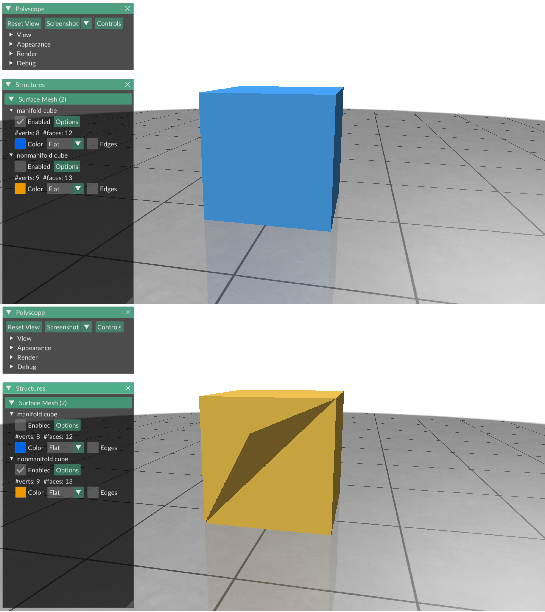

# Exercise 06
_Geometry Processing Research in Python_

## Halfedges and adjacency

In [exercise 06](../exercise_06) we learned how to compute a variety of
basic geometric quantities of meshes.
These were all either per-vertex or per-face quantities.
This exercise delves into _halfedges_ and _edges_.

### Edges

If you have a triangle mesh `V,F`, Gpytoolbox gives you an easy way to get a
list of all edges as a polyline into the vertex list `V` with its
`edges` function:
```python
import gpytoolbox as gpy, numpy as np, polyscope as ps
V,F = gpy.read_mesh("data/penguin.obj")
E = gpy.edges(F)
ps.init()
ps_penguin = ps.register_surface_mesh("penguin", V, F)
ps_penguin_edges = ps.register_curve_network("penguin edges", V, E)
ps.show()
```

This displays:


### Halfedges

The edges returned by the `edges` function are polylines that reference the
vertex list.
There is no simple one-to-one correspondence from edges to faces, since the
number of edges is generally independent of the number of faces in a triangle
mesh.
There is however, an edge-like feature of a mesh that directly corresponds to
the triangles: the _halfedge_.

If you draw each edge multiple times, once for each triangle that it is
contained in, these multiple edges are called halfedges.
Each halfedge is associated with one triangle in particular, and
each triangle has three halfedges.
By convention, the i-th halfedge is opposite the i-th vertex in a face.

While edges do not have a canonical orientation (the orientation returned by
Gpytoolbox's `edges` is arbitrary), halfedges are oriented by the vertex indices
in the face list `F`:
The 0 halfedge of face `i` goes from vertex `F[i,1]` to vertex `F[i,2]`.

Gpytoolbox's `halfedges` function computes halfedges for every triangle in
the mesh.
`he = gpy.halfedges(F)` is a `(m,3,2)` NumPy array:
- The *first* axis is over all faces of the mesh (there is a triple of halfedges per face).
- The *second* axis has dimension 3 and contains the 3 halfedges of each face.
- The *third* axis contains the actual indices of the first and second vertices of the halfedge.

So, `he[i,0,0]` is the first vertex of the 0 halfedge of face `i`, i.e., the
vertex with index `F[i,1]`.

Each halfedge is uniquely identified by its index in the array `he`.
This convention is maintained all throughout Gpytoolbox:
The halfedge `(i,j)` is the edge connecting the vertices `he[i,j,0]` and
`he[i,j,1]`.

```python
import gpytoolbox as gpy
V,F = gpy.read_mesh("data/penguin.obj")
he = gpy.halfedges(F)
print(f"Halfedge (2,1) goes from vertex {he[2,1,0]} to {he[2,1,1]}. It is opposite the vertex {F[2,1]} in the face {F[2,:]}.")
```

This prints:
```
Halfedge (2,1) goes from vertex 10092 to 1466. It is opposite the vertex 10085 in the face [ 1466 10085 10092].
```

Gpytoolbox can compute correspondences between edges and
halfedges, if desired, using the `halfedge_edge_map` function.
It returns two index vectors:
- `he_to_E` is a array that tells you which row in `E` corresponds to which unique halfedge `(i,j)`, as `he[i,j,:] == E[he_to_E[i,j],:]`.
- `E_to_he` is an array that tells you which halfedges correspond to the edge `e`. `E[e,:] == he[E_to_he[e,0,0],E_to_he[e,0,1],:]`, and, if `E` corresponds to two halfedges (i.e., it is not a boundary edge), then `E[e,:] == he[E_to_he[e,1,0],E_to_he[e,1,1],:]`.
If `E` only corresponds to one halfedge, then `E_to_he[e,1,0] == E_to_he[e,1,1] == -1`.
```python
import gpytoolbox as gpy
V,F = gpy.read_mesh("data/penguin.obj")
he,E,he_to_E,E_to_he = gpy.halfedge_edge_map(F)
print(f"Halfedge (2,1) is the same as edge {he_to_E[2,1]}: {he[2,1,:]} == {E[he_to_E[2,1],:]}.")
print(f"Edge 5 is the same as halfedges {E_to_he[5,0,:]} and {E_to_he[5,1,:]}: {E[5,:]} == {he[E_to_he[5,0,0],E_to_he[5,0,1],:]} == {he[E_to_he[5,1,0],E_to_he[5,1,1],:]}.")
```

This prints:
```
Halfedge (2,1) is the same as edge 8872: [10092  1466] == [10092  1466].
Edge 5 is the same as halfedges [2828    1] and [3459    2]: [3367    0] == [3367    0] == [   0 3367].
```

### Manifoldness

An edge manifold mesh is a mesh where every edge is contained in at most two
faces.
Many geometry processing methods require an edge manifold mesh as input.
In Gpytoolbox you can easily check whether a mesh is edge manifold or not
using the function `non_manifold_edges`:

```python
import gpytoolbox as gpy, numpy as np, polyscope as ps
ps.init()
V,F = gpy.read_mesh("data/manifold_cube.obj")
ne = gpy.non_manifold_edges(F)
print(f"nonmanifold edges: {ne}")
ps_manifold_cube = ps.register_surface_mesh("manifold cube", V, F)
V,F = gpy.read_mesh("data/non_manifold_cube.obj")
ne = gpy.non_manifold_edges(F)
print(f"nonmanifold edges: {ne}")
ps_non_manifold_cube = ps.register_surface_mesh("nonmanifold cube", V, F)
ps.show()
```

This prints:
```
nonmanifold edges: []
nonmanifold edges: [[2 7]]
```

and displays (enabling the two surfaces separately):



_NOTE: `halfedge_edge_map`, as described above, expects a manifold mesh as input.
If your mesh is not manifold, you can pass the argument `assume_manifold=False` to it, which will slightly change the output of the function - refer to the documentation for details._

### Adjacency

For many applications you might be interested in knowing which triangles are
adjacent to which triangles.
Gpytoolbox exposes this information in a more accessible format
with its `triangle_triangle_adjacency` function.
It returns two index arrays:
- `TT`, an array specifying which face is adjacent to the halfedge `(i,j)` in face `i` (or -1 if there is no adjacent face).
- `TTi`, an array specifying the j-index of the halfedge adjacent to the halfedge `(i,j)` (or -1 if there is no adjacent face).

So, for any halfedge `(i,j)` with an adjacent halfedge,
`(TT[i,j], TTi[i,j]) == (i,j)`:
```python
import gpytoolbox as gpy
V,F = gpy.read_mesh("data/penguin.obj")
TT, TTi = gpy.triangle_triangle_adjacency(F)
print(f"Halfedge {(TT[6,2], TTi[6,2])} is adjacent to halfedge {(6,2)}.")
print(f"Triangle {6} has the 3 neighbors {TT[6,0]}, {TT[6,1]}, and {TT[6,2]}.")
```

This prints:
```
Halfedge (3366, 1) is adjacent to halfedge (6, 2).
Triangle 6 has the 3 neighbors 20166, 13632, and 3366.
```

## That's it!

The next exercise, [exercise_07](../exercise_07), is all about how to deal
with randomness.

---

_Oded Stein 2024. [Geometry Processing Research in Python](https://github.com/odedstein/geometry-processing-research-in-python)_

