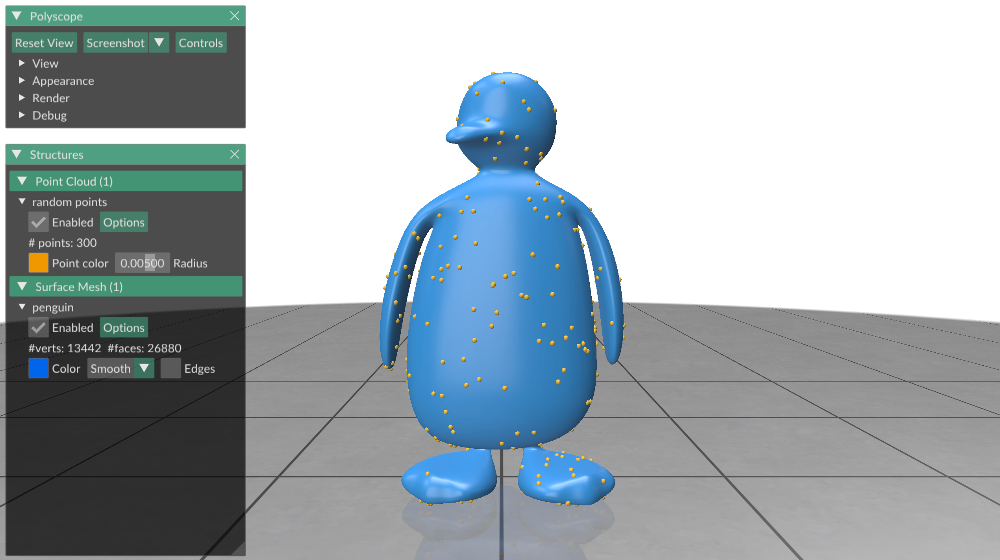
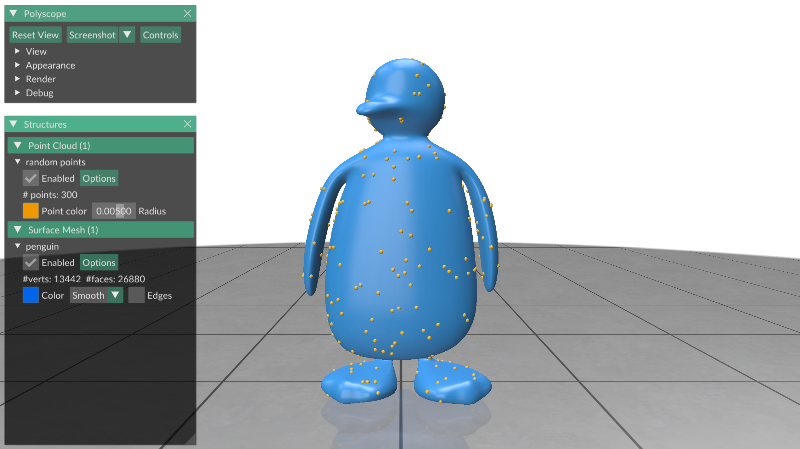
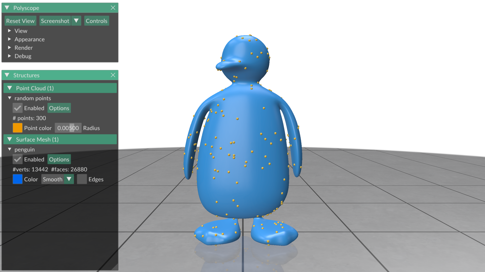

# Exercise 07
_Geometry Processing Research in Python_

## Randomness

For many applications in geometry processing we want to incorporate an element
of randomness.
Maybe we want a random initialization for an algorithm, or we just want to
select places to do something without any regularity.
In this exercise you will learn how randomness works in Gpytoolbox, and how to
maintain good scientific practice when using randomness in your research.

### Sampling random points - Here's what not to do!

If you want to sample random points on a surface uniformly, Gpytoolbox has a
simple function for that: `random_points_on_mesh`.
It takes in the surface, as well as the number of points you are sampling.
```python
import gpytoolbox as gpy, numpy as np, polyscope as ps
V,F = gpy.read_mesh("data/penguin.obj")
P = gpy.random_points_on_mesh(V, F, 300)
ps.init()
ps_penguin = ps.register_surface_mesh("penguin", V, F,
    material='wax', smooth_shade=True)
ps_pts = ps.register_point_cloud("random points", P)
ps.show()
```

This displays:



This seems fine.
But what if we run the same script again?



Those are different points than last time!
On one hand, of course, this makes sense:
You asked for random points, so why would you get the same set of random points
both times?
But if you are a scientist, you should aim for your work to be reproducible.

### Reproducible randomness

In order to create reproducible scripts, we can seed the random number engine
with a constant seed, making sure that it always reproduces the same results
when a script is run again.

Gpytoolbox (mostly) uses the NumPy randomness paradigm:
A [random generator](https://numpy.org/doc/stable/reference/random/generator.html), which gets passed to every function that needs random numbers, controls random
number generation throughout the entire script.
You can initialize it with:
```python
import numpy as np
rng = np.random.default_rng()
print(f"A random number: {rng.random()}")
print(f"Another random number: {rng.random()}")
```

This prints:
```
A random number: 0.4975738858606218
Another random number: 0.3865480452803277
```

Of course it only prints this on my computer, not on yours.
If you initialize a NumPy `default_rng` without any arguments, it gets
randomness from a reliably random source, usually a piece of hardware in your
computer.
Case in point, if I run this script a second time, I get:
```
A random number: 0.036213920801204
Another random number: 0.9806510984456254
```

This is great for cryptographic safety, but bad for reproducibility.
We can create a reproducible NumPy `rng` by seeding it with a fixed integer:
```python
import numpy as np
seed = 8745932
rng = np.random.default_rng(seed)
print(f"A random number: {rng.random()}")
print(f"Another random number: {rng.random()}")
```

This prints:
```
A random number: 0.37597233604132463
Another random number: 0.1206232325698362
```

If I run it again:
```
A random number: 0.37597233604132463
Another random number: 0.1206232325698362
```

### Reproducible randomness in Gpytoolbox

Gpytoolbox functions with randomness capability accept a NumPy `rng` object to
allow you to write reproducible programs.
The `random_points_on_mesh` function works as follows:
```python
import gpytoolbox as gpy, numpy as np, polyscope as ps
seed = 8745932
rng = np.random.default_rng(seed)
V,F = gpy.read_mesh("data/penguin.obj")
P = gpy.random_points_on_mesh(V, F, 300, rng=rng)
ps.init()
ps_penguin = ps.register_surface_mesh("penguin", V, F,
    material='wax', smooth_shade=True)
ps_pts = ps.register_point_cloud("random points", P)
ps.show()
```

This displays:



If I run it a second time, I get exactly the same result


_NOTE: Some Gpytoolbox functions will take seeds directly, and not `rng`
objects.
For these, you ran generate a seed from your `rng` object with
`rng.integers(np.iinfo(np.int32).max)`._

## That's it!

The next exercise, [exercise_08](../exercise_08), will teach you how to build
and use finite element matrices.

---

_Oded Stein 2024. [Geometry Processing Research in Python](https://github.com/odedstein/geometry-processing-research-in-python)_

