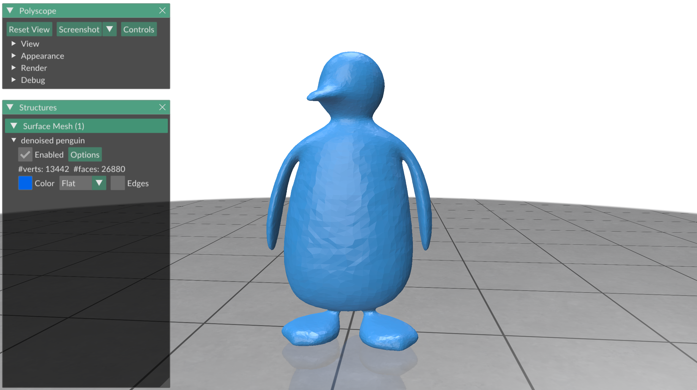

# Exercise 08
_Geometry Processing Research in Python_

## Finite element matrices

Partial differential equations (PDEs) and their operators are the bread and
butter of the sort of geometry processing research that I do
(in face, I wrote a
[theory course](https://odedstein.com/projects/sgp-2021-lap-bilap-course/)
about finite elements in the graphics context).
In this exercise you will learn how to construct the finite element
discretization of the few most used differential operators in geometry
processing: the, _mass matrix_ and the _Laplacian_.

### Finite elements

This is not a finite element course, but in this section I will give you a few
very basic facts that will help you understand how finite elements work in the
Gpytoolbox setting.

Differential operators are usually formulated on any continuous function
$$u : \Omega \rightarrow \mathbb{R},$$
where $\Omega$ is our surface.
A finite element operator instead operates on a finite-dimensional function
space instead.
In our case, the dimension of the function space is just the number of vertices
on a mesh.
So the discrete function
$$\mathbf{u} : \Omega \rightarrow \mathbb{R}$$
is just a per-vertex function with one scalar per vertex, which we represent by
a NumPy array.

Finite element operators are always written in their weak form.
Let us look at our first operator, the Laplacian, to see what this means.

### Laplacian

You might know the definition of the Laplacian from a calculus class,
$\Delta u (x,y) = - \left( \frac{\partial^2 u (x,y) }{\partial x^2} + \frac{\partial^2 u (x,y) }{\partial y^2} \right)$.
Actually, partial derivatives are a bit unwieldy when used on surfaces.
Instead, I prefer to use the definition of the Laplacian using the gradient
$\nabla$ and the divergene $\nabla \cdot$, $\Delta u = - \nabla \cdot \nabla u$.

The finite element Laplacian operator is not written in this simple form.
Instead of describing what happens to the function at every point on the
surface, it describes what happens to the function when integrated with respect
to any other function: This is called the _weak form_.
We compute the weak form of an operator by multiplying it with an arbitrary
function and integrating over the whole surface.

In this language of weak forms, the Laplacian of $u$ is actually a bilinear
operator, so that, for all functions $v$ (and $v$ does not have to be the same
as $u$), it holds
$$L(u,v) = \int_\Omega (\Delta u) v \textrm{ } dx.$$

There are a variety of reasons to define differential operators like this.
I recommend reading a finite element course
[like this one](https://odedstein.com/projects/sgp-2021-lap-bilap-course/)
if you are interested in the reasons why.
For our purposes, what makes this formulation interesting is that, for
per-vertex functions $\mathbf{u}, \mathbf{v}$ with $n$ entries, the operator
$L(\mathbf{u},\mathbf{v})$ is simply a $n \times n$ matrix.
In fact, it is a $n \times n$ _sparse_ matrix.

Gpytoolbox contains a routine for computing a per-vertex finite element
Laplacian with its `cotangent_laplacian` function:
```python
import gpytoolbox as gpy, numpy as np, polyscope as ps
V,F = gpy.read_mesh("data/penguin.obj")
L = gpy.cotangent_laplacian(V, F)
```

We can test out a basic fact about Laplacians right away:
The Laplacian of a constant function is zero:
```python
import gpytoolbox as gpy, numpy as np, polyscope as ps
V,F = gpy.read_mesh("data/penguin.obj")
L = gpy.cotangent_laplacian(V, F)
u = np.ones(V.shape[0])
print(f"The Laplacian of a constant function: {np.dot(u, L*u)}")
```

This prints:
```
The Laplacian of a constant function: 3.989820626659757e-14
```

### Mass matrix

The mass matrix is the second important finite element matrix.
It computes the simple integral of a product of two functions:
$$M(u,v) = \int_\Omega u v \textrm{ } dx.$$

Gpytoolbox compuptes the mass matrix with the function `massmatrix`:
```python
import gpytoolbox as gpy, numpy as np, polyscope as ps
V,F = gpy.read_mesh("data/penguin.obj")
M = gpy.massmatrix(V, F)
```

Let us try to use the mass matrix to compute the area of a unit sphere by
evaluating the mass matrix on two unit functions:
```python
import gpytoolbox as gpy, numpy as np, polyscope as ps
V,F = gpy.icosphere(5)
M = gpy.massmatrix(V, F)
u = np.ones(V.shape[0])
print(f"The area of a sphere is: {np.dot(u, M*u)}")
```

This prints:
```
The area of a sphere is: 12.562613468058455
```

### Surface fairing

A very simple application of the Laplacian in geometry processing is
_surface fairing_: the denoising of a noisy surface.

Consider the following noisy penguin:
```python
import gpytoolbox as gpy, numpy as np, polyscope as ps
V,F = gpy.read_mesh("data/noisy_penguin.obj")
ps.init()
ps_penguin = ps.register_surface_mesh("noisy penguin", V, F,
    material='wax')
ps.show()
```

This displays:


[Desbrun et al. 1999](http://multires.caltech.edu/pubs/ImplicitFairing.pdf)
introduce a very simple method for denoising this surface by solving the
following differential equation:
$$u = u_{\text{noisy}} - t \Delta u,$$
where $t$ is a parameter controlling the strength of the denoising.

To get the weak for of this expression (so that we will be able to use our
Laplacian), we multiply with an arbitrary function $v$:
$$\int_\Omega u v \textrm{ } dx = \int_\Omega u_{\text{noisy}} v \textrm{ } dx - t \int_\Omega (\Delta u) v \textrm{ } dx,$$
$$M(u, v) = M(u_{\text{noisy}}, v) - t L(u, v).$$

Written out with discrete final element matrices $\mathbf{L}, \mathbf{M}$ and
discrete functions $\mathbf{u}$, $\mathbf{u}_{\text{noisy}}$, this
becomes the matrix equation
$$\left( \mathbf{M} + t \mathbf{L} \right) \mathbf{u} = \mathbf{M) \mathbf{u}_{\text{noisy}}.$$

We can solve this simple linear equation using SciPy's sparse linear solvers:
```python
import gpytoolbox as gpy, numpy as np, scipy as sp, polyscope as ps
V0,F = gpy.read_mesh("data/noisy_penguin.obj")
L = gpy.cotangent_laplacian(V0, F)
M = gpy.massmatrix(V0, F)
t = 5e-3
V = sp.sparse.linalg.spsolve(M + t*L, M*V0)
ps.init()
ps_penguin = ps.register_surface_mesh("denoised penguin", V, F,
    material='wax')
ps.show()
```

This displays:



## That's it!

In the next exercise, [exercise_09](../exercise_09), you will learn how to
solve simple quadratic optimization problems with Gpytoolbox.

---

_Oded Stein 2024. [Geometry Processing Research in Python](https://github.com/odedstein/geometry-processing-research-in-python)_

