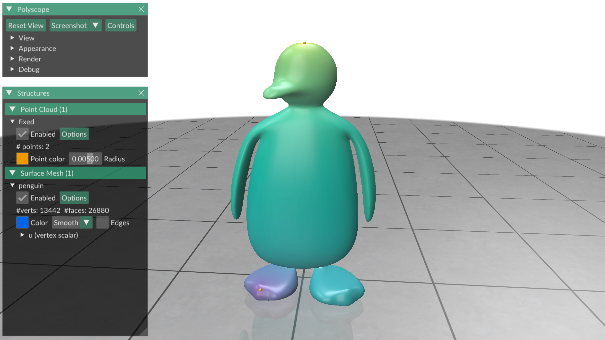
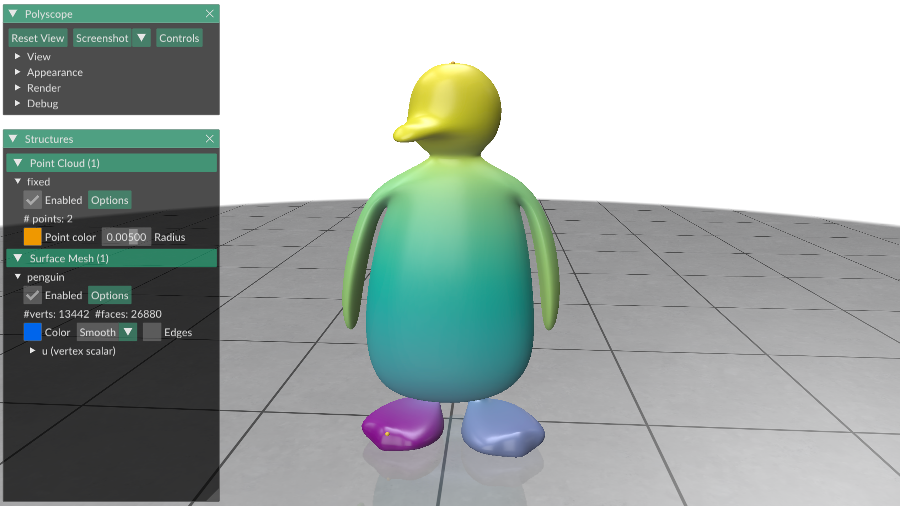
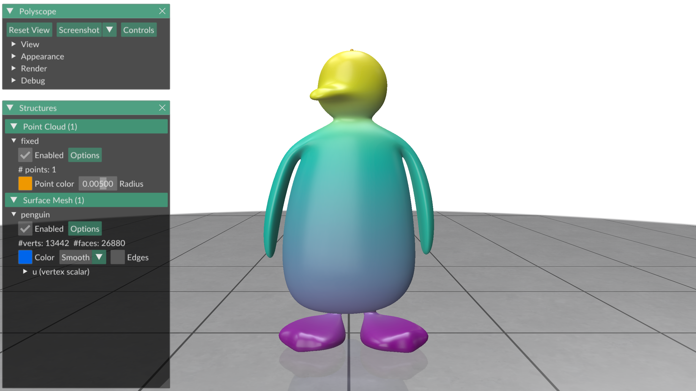

# Exercise 09
_Geometry Processing Research in Python_

## Optimization

Many research problems in geometry processing can be formulated as the solution
of a quadratic optimization problem.
In this exercise you will learn how to use Gpytoolbox to solve the following
problem:
$$\mathop{\text{argmin}}\limits_{\mathbf{u} \in \mathbb{R}^n} \frac{1}{2} \mathbf{u}^{\intercal} \mathbf{Q} \mathbf{u} + \mathbf{c}^{\intercal} \mathbf{u}
\quad \textrm{s.t. } \mathbf{A}\mathbf{u} = \mathbf{b} \textrm{ and } \mathbf{u}[\mathbf{k}] = \mathbf{y},$$
where $\mathbf{Q} \in \mathbb{R}^{n \times n}$ symmetric, $\mathbf{c} \in \mathbb{R}^{n}$, $\mathbf{A} \in \mathbb{R}^{m \times n}$, $\mathbf{b} \in \mathbb{R}^{m}$, $\mathbf{k}$ an $o$-dimensional index array, and $\mathbf{y} \in \mathbb{R}^{o}$.

This simple optimization problem is a real workhorse in my geometry processing
research.
You would not believe how many research problems basically boil down to a
rewrite as a constrained quadratic optimization problem!

### min_quad_with_fixed

Gpytoolbox's function for solving quadratic optimization problems is
`min_quad_with_fixed`.
Let us warm up by solving a quick optimization problem.
Where is the function $f(x) = 4 x^2 + 7 x - 2$ minimized?
```python
import gpytoolbox as gpy, numpy as np, scipy as sp
Q = sp.sparse.csr_matrix(np.array([[8.]]))
c = np.array([7.])
x = gpy.min_quad_with_fixed(Q=Q, c=c)
print(f"f is optimized at x = {x}.")
```

This prints:
```
f is optimized at x = [-0.875].
```

This works when $Q$ is a larger matrix too:
```python
import gpytoolbox as gpy, numpy as np, scipy as sp
Q = sp.sparse.csr_matrix(np.array([[3., 0., 7.], [1., -6., 0.], [0., 0., -5.]]))
c = np.array([7., 0.5, -2.])
x = gpy.min_quad_with_fixed(Q=Q, c=c)
print(f"f is optimized at x = {x}.")
```

This prints:
```
f is optimized at x = [-1.02731411 -0.00227618 -1.11911988].
```

_NOTE: min_quad_with_fixed does not actually find the minimum of a quadratic
optimization problem - it finds a critical point, which could also be a saddle
or a maximum._

### Index constraints

So far this has been not that impressive - we have not seen
`min_quad_with_fixed` do anything that using a sparse SciPy solver does not do
by itself.
Let us now explore _index constraints_ in the quadratic minimization problem.
This means solving the optimization problem $\mathop{\text{argmin}}\limits_{\mathbf{u} \in \mathbb{R}^n} \frac{1}{2} \mathbf{u}^{\intercal} \mathbf{Q} \mathbf{u} + \mathbf{c}^{\intercal} \mathbf{u}$
subject to the constraint that certain entries in the solution
$\mathbf{u}$ are fixed to known values.

Let $\mathbf{k}$ be an index vector indexing the solution $\mathbf{u}$, and let
$\mathbf{y} \in \mathbb{R}^o$ be the values that we want the solution to be
fixed to.
With this constraint, `min_quad_with_fixed` will return the optimal solution
$\mathbf{u}$ such that
$$\mathbf{u}_{\mathbf{k}_i} = \mathbf{y}_i \quad \forall i = 1, \dots, o .$$

This is particularly useful to find "the smoothest function fulfilling some
constraint".
For example, in the following example we are looking for the smoothest function
that is 1 on the head of the penguin, and 0 on the foot of the penguin.
We use the Laplacian matrix from [exercise_08](../exercise_08) as our
smoothness energy `Q`:
```python
import gpytoolbox as gpy, numpy as np, scipy as sp, polyscope as ps
V,F = gpy.read_mesh("data/penguin.obj")
L = gpy.cotangent_laplacian(V, F)
head_index = 7302
foot_index = 9916
k = np.array([head_index, foot_index])
y = np.array([1., 0.])
L = gpy.cotangent_laplacian(V, F)
u = gpy.min_quad_with_fixed(Q=L, k=k, y=y)
ps.init()
ps_penguin = ps.register_surface_mesh("penguin", V, F,
    material='wax', smooth_shade=True)
ps_penguin.add_scalar_quantity("u", u, enabled=True)
fixed_cloud = ps.register_point_cloud("fixed", V[k,:])
ps.show()
```

This displays:



We are not limited to the Laplacian of course.
We can use the biharmonic smoothness energy, available in Gpytoolbox with
`biharmonic_energy`:

```python
import gpytoolbox as gpy, numpy as np, scipy as sp, polyscope as ps
V,F = gpy.read_mesh("data/penguin.obj")
L = gpy.cotangent_laplacian(V, F)
head_index = 7302
foot_index = 9916
k = np.array([head_index, foot_index])
y = np.array([1., 0.])
Q = gpy.biharmonic_energy(V, F)
u = gpy.min_quad_with_fixed(Q=Q, k=k, y=y)
ps.init()
ps_penguin = ps.register_surface_mesh("penguin", V, F,
    material='wax', smooth_shade=True)
ps_penguin.add_scalar_quantity("u", u, enabled=True)
fixed_cloud = ps.register_point_cloud("fixed", V[k,:])
ps.show()
```

This displays:



_NOTE: There are many different smoothness energies that you might want to use
for different reasons.
For the particular problem of two isolated fixed vertices, it is probably
always more desirable to use the biharmonic energy compared to the simple
Laplacian.
The choice of smoothness energy goes beyond the scope of this tutorial._

### Linear equality constraints

The last kind of constraint supported by `min_quad_with_fixed` is the linear
equality constraint.
This means solving the optimization problem $\mathop{\text{argmin}}\limits_{\mathbf{u} \in \mathbb{R}^n} \frac{1}{2} \mathbf{u}^{\intercal} \mathbf{Q} \mathbf{u} + \mathbf{c}^{\intercal} \mathbf{u}$
subject to the constraint $\mathbf{A}\mathbf{u} = \mathbf{b}$.

You can use this constraint, for example, to find the smoothest function on
the penguin that integrates to zero and is 1 on the heat of the penguin.

```python
import gpytoolbox as gpy, numpy as np, scipy as sp, polyscope as ps
V,F = gpy.read_mesh("data/penguin.obj")
L = gpy.cotangent_laplacian(V, F)
M = gpy.massmatrix(V, F)
head_index = 7302
k = np.array([head_index])
y = np.array([1.])
A = sp.sparse.csr_matrix(np.ones(V.shape[0]).T * M)
b = np.array([0.])
Q = gpy.biharmonic_energy(V, F)
u = gpy.min_quad_with_fixed(Q=Q, k=k, y=y, A=A, b=b)
print(f"u integrates to {np.sum(M*u)}.")
ps.init()
ps_penguin = ps.register_surface_mesh("penguin", V, F,
    material='wax', smooth_shade=True)
ps_penguin.add_scalar_quantity("u", u, enabled=True)
fixed_cloud = ps.register_point_cloud("fixed", V[k,:])
ps.show()
```

This prints:
```
u integrates to -1.149080830487037e-13.
```

and displays:



_NOTE: Every index constraint can, of course, be written as a linear equality
constraint as well.
For performance reasons, it is preferable to use the index constraint if
possible, though._

_NOTE: You can freely mix index and linear equality constraints._

### Precomputation

You can solve multiple optimization problems that share the same $\mathbf{Q}$,
$\mathbf{k}$, and $\mathbf{A}$ matrices and only differ in $\mathbf{c}$,
$\mathbf{y}$, and $\mathbf{b}$ very efficiently using _precomputation_.
Precomputation of a `min_quad_with_fixed` problem works just like precomputing
a matrix decomposition for a sparse linear solve back from
[exercise_01](../exercise_01), using the functions
`min_quad_with_fixed_precompute` and `solve`:
```python
import gpytoolbox as gpy, numpy as np, scipy as sp
Q = sp.sparse.csr_matrix(np.array([[3., 0., 7.], [1., -6., 0.], [0., 0., -5.]]))
c1 = np.array([7., 0.5, -2.])
c2 = np.array([-2., -0.5, -6.])
mqwf = gpy.min_quad_with_fixed_precompute(Q=Q)
x1 = mqwf.solve(c=c1)
print(f"f with c1 is optimized at x = {x1}.")
x2 = mqwf.solve(c=c2)
print(f"f with c2 is optimized at x = {x2}.")
```

This prints:
```
f with c1 is optimized at x = [-1.02731411 -0.00227618 -1.11911988].
f with c2 is optimized at x = [ 1.13657056  0.01138088 -0.40440061].
```

## That's it!

In the next exercise, [exercise_10](../exercise_10), you will see how you can
add and remove detail from surfaces with Gpytoolbox.

---

_Oded Stein 2024. [Geometry Processing Research in Python](https://github.com/odedstein/geometry-processing-research-in-python)_

