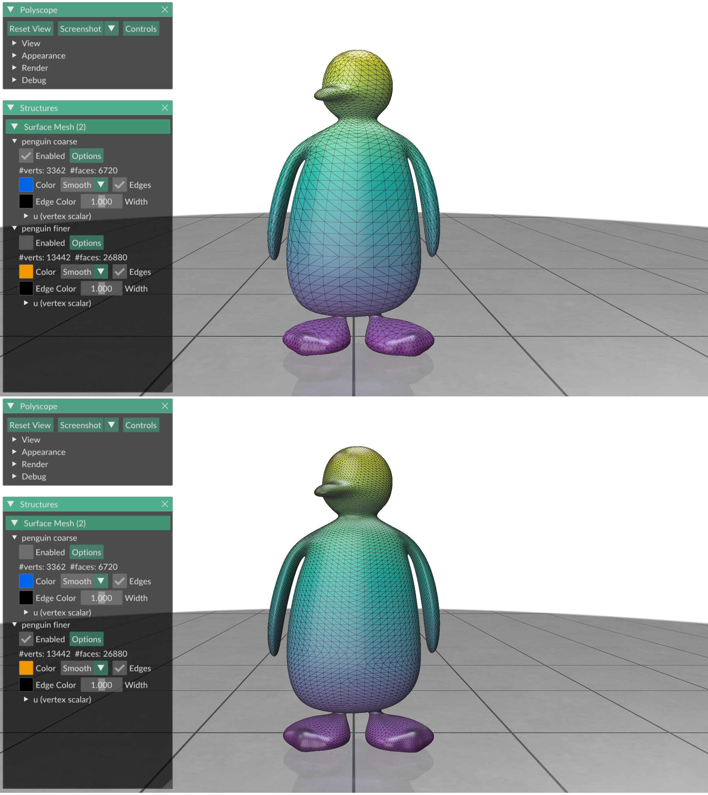

# Exercise 10
_Geometry Processing Research in Python_

## Subdivision and decimation

Let us end this tutorial on a light note.
The last two common geometry processing tasks that we will learn how to do are
_subdivision_ and _decimation_.

### Subdivision

Sometimes you have a coarse mesh, and you want to transform it into a fine,
dense, and smooth mesh.
One way to achieve this is to subdivide the mesh.
Gpytoolbox implements [Loop subdivision](https://www.microsoft.com/en-us/research/publication/smooth-subdivision-surfaces-based-on-triangles/), a standard
method for this task.
To use it, call the `subdivide` function with the `method='loop'` option.
With the `iters` option, you can specify how much you want to subdivide/smooth
your surface:
```python
import gpytoolbox as gpy, numpy as np, polyscope as ps
V,F = gpy.read_mesh("data/penguin_low_res.obj")
V1,F1 = gpy.subdivide(V, F, method='loop')
V3,F3 = gpy.subdivide(V, F, method='loop', iters=3)
ps.init()
ps_penguin0 = ps.register_surface_mesh("penguin coarse", V, F,
    material='wax', smooth_shade=True, edge_width=1.)
ps_penguin1 = ps.register_surface_mesh("penguin finer", V1, F1,
    material='wax', smooth_shade=True, edge_width=1.)
ps_penguin3 = ps.register_surface_mesh("penguin finest", V3, F3,
    material='wax', smooth_shade=True, edge_width=1.)
ps.show()
```

This displays (enabling the different surfaces separately)


Loop subdivision is a linear operation.
This means that there is a matrix `S` such that `V1 == S*V`.
We can use this property to upsample any function `u` on the coarse mesh `V`
to the subdivided mesh `V1` with `S*u`.
To obtain the matrix `S` from Gpytoolbox, set the property `return_matrix=True`:
```python
import gpytoolbox as gpy, numpy as np, polyscope as ps
V,F = gpy.read_mesh("data/penguin_low_res.obj")
u = V[:,1]
V1,F1,S = gpy.subdivide(V, F, method='loop', return_matrix=True)
ps.init()
ps_penguin0 = ps.register_surface_mesh("penguin coarse", V, F,
    material='wax', smooth_shade=True, edge_width=1.)
ps_penguin0.add_scalar_quantity("u", u, enabled=True)
ps_penguin1 = ps.register_surface_mesh("penguin finer", V1, F1,
    material='wax', smooth_shade=True, edge_width=1.)
ps_penguin1.add_scalar_quantity("u", S*u, enabled=True)
ps.show()
```

This displays (enabling the different surfaces separately)



### Decimation

What if you have a very fine mesh, but you want a coarse mesh?
This is what _decimation_ is for.

In Gpytoolbox you can get a coarse mesh from a fine edge using the `decimate`
method.
It takes as arguments the mesh `V`, `F`, and the face ratio (what do you want
the ratio of faces in the new mesh to be like compared to the old mesh):
```python
import gpytoolbox as gpy, numpy as np, polyscope as ps
V,F = gpy.read_mesh("data/penguin_high_res.obj")
V1,F1,_,_ = gpy.decimate(V, F, face_ratio=0.2)
V2,F2,_,_ = gpy.decimate(V, F, face_ratio=0.05)
ps.init()
ps_penguin0 = ps.register_surface_mesh("penguin fine", V, F,
    material='wax', smooth_shade=True, edge_width=1.)
ps_penguin1 = ps.register_surface_mesh("penguin decimated", V1, F1,
    material='wax', smooth_shade=True, edge_width=1.)
ps_penguin2 = ps.register_surface_mesh("penguin decimated more", V2, F2,
    material='wax', smooth_shade=True, edge_width=1.)
ps.show()
```

This displays (enabling the different surfaces separately)


_NOTE: Instead of `face_ratio`, you can also specify your desired target face
count directly with the `num_faces` argument._

## That's it!

That was everything in this tutorial for now.
You now know how to get started with a few basic geometry processing tasks in
Python.
Now, go have fun with your own research project!

---

_Oded Stein 2024. [Geometry Processing Research in Python](https://github.com/odedstein/geometry-processing-research-in-python)_

